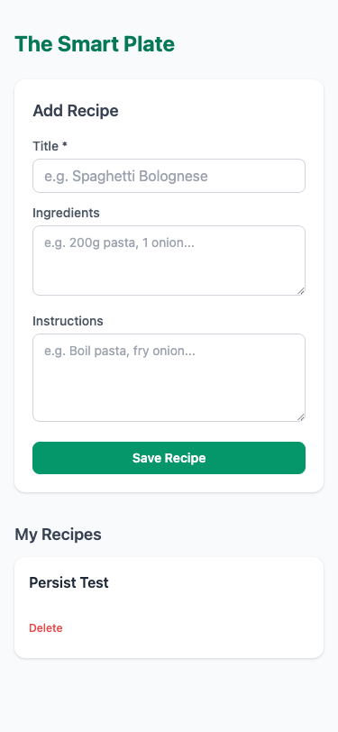

# Test Results: BKI-001 — Build Basic Digital Recipe Box (Save, View, Delete)

## Overview
All 6 functional ACs and 2 NFR checks verified via Playwright browser automation against a local HTTP server (`http://localhost:8765`). Mobile viewport tested at 375px width with screenshot capture.

## AC Coverage

| AC | Description | Tool | Result | Notes |
|----|-------------|------|--------|-------|
| AC-1 | Save recipe — happy path | `browser_fill_form` + `browser_click` + `browser_snapshot` | pass | Form cleared after save; recipe appeared in list |
| AC-2 | Save blocked — empty Title | `browser_click` + `browser_snapshot` | pass | "Title is required" error shown; list unchanged |
| AC-3 | List renders all saved recipes on load | `browser_run_code` (page.reload) | pass | "Persist Test" recipe present after page reload |
| AC-4 | Empty state shown when no recipes | `browser_snapshot` on fresh load | pass | "No recipes yet. Add one above!" confirmed |
| AC-5 | Delete removes from list and storage | `browser_run_code` (confirm=true mock) | pass | Empty state shown; absent after reload |
| AC-6 | Delete cancel keeps recipe intact | `browser_run_code` (confirm=false mock) | pass | `afterCancel=1` confirmed recipe intact |
| AC-N1 | Usable on 375px viewport | `browser_resize` + `browser_take_screenshot` | pass | See screenshot below |
| AC-N2 | No console errors on load/save/delete | `browser_console_messages` | pass | Only favicon 404 — not app code |

## Artifacts

### AC-N1 — Mobile Viewport 375×812px

## Defects Found
None.

## Sign-off
- [x] All ACs pass
- [x] Artifacts present in tests/
- [x] Ready for DoD close
