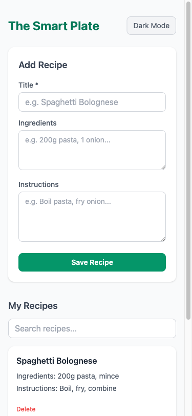
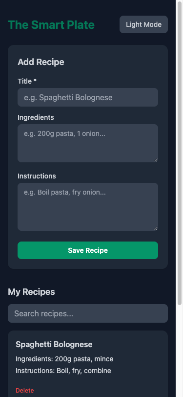

# Test Results: BKI-002 — Add Recipe Search and Dark Mode

## Overview
All 6 functional ACs and 3 NFR checks verified via Playwright browser automation against `http://localhost:8765`. Mobile viewport and dark mode contrast verified via screenshots.

## AC Coverage

| AC | Description | Tool | Result | Notes |
|----|-------------|------|--------|-------|
| AC-1 | Search filters list by matching title (case-insensitive) | `browser_run_code` (fill `#search` 'spa') | pass | Returned `["Spaghetti Bolognese"]` only |
| AC-2 | Clear search restores all recipes | `browser_run_code` (fill `#search` '') | pass | `ac2=2` — both recipes shown |
| AC-3 | No match shows "No recipes match your search." | `browser_run_code` (fill `#search` 'zzznomatch') | pass | Message confirmed |
| AC-4 | Dark mode toggles on, button label changes | `browser_run_code` (click `#dark-toggle`) | pass | `ac4=true`, label → "Light Mode" |
| AC-5 | Dark mode persists after reload | `browser_run_code` (page.reload) | pass | `ac5=true` after reload |
| AC-6 | Second toggle restores light mode | `browser_run_code` (click `#dark-toggle`) | pass | `ac6=false`, label → "Dark Mode" |
| AC-N1 | Search input usable on 375px viewport | `browser_resize` + `browser_take_screenshot` | pass | See screenshot below |
| AC-N2 | Dark mode has readable contrast | `browser_take_screenshot` in dark mode | pass | See screenshot below |
| AC-N3 | No console errors | `browser_console_messages` | pass | 0 errors, 0 warnings |

## Artifacts

### AC-N1 — Mobile Viewport 375×812px (Light Mode)

### AC-N2 — Dark Mode Contrast

## Defects Found
None.

## Sign-off
- [x] All ACs pass
- [x] Artifacts present in tests/
- [x] Ready for DoD close
